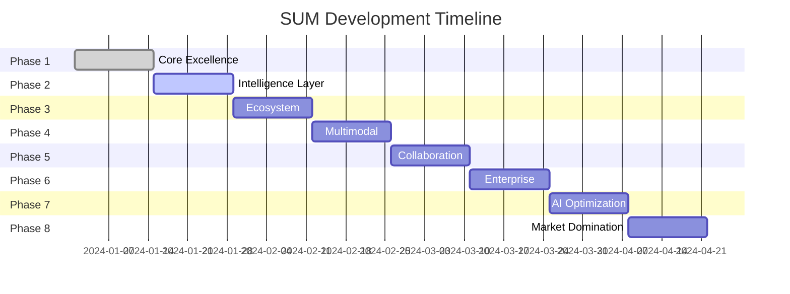

# SUM Implementation Roadmap: Becoming Synonymous with Summarization

## Executive Summary
Transform SUM into the definitive knowledge crystallization platform that makes all other summarization tools obsolete. Our goal: Make "Just SUM it" as natural as "Google it."

## Phase 1: Core Excellence (Weeks 1-2) ✅ COMPLETED

### Knowledge Crystallization Engine ✅
- ✅ Implemented 8-level density control (essence to comprehensive)
- ✅ Created 10 style personas (Hemingway to Developer)
- ✅ Built quality scoring system
- ✅ Added preference learning framework

### Revolutionary API ✅
- ✅ `/api/crystallize` - Main crystallization endpoint
- ✅ `/api/crystallize/progressive` - Streaming density levels
- ✅ `/api/crystallize/adaptive` - Auto-adapt to content
- ✅ `/api/crystallize/compare` - Compare styles side-by-side
- ✅ `/api/crystallize/batch` - Process multiple texts

### Zero-Friction UI ✅
- ✅ Beautiful gradient interface with glassmorphism
- ✅ Real-time density slider
- ✅ Style persona selector
- ✅ Progressive disclosure of summary levels
- ✅ One-click copy functionality

## Phase 2: Intelligence Layer (Weeks 3-4) 🚧 IN PROGRESS

### Advanced ML Integration
```python
# TODO: Integrate transformer models
from transformers import pipeline

class TransformerCrystallizer:
    def __init__(self):
        self.summarizer = pipeline("summarization", model="facebook/bart-large-cnn")
        self.classifier = pipeline("zero-shot-classification")
        self.sentiment = pipeline("sentiment-analysis")
```

### Semantic Understanding
- [ ] Entity recognition and linking
- [ ] Topic modeling with LDA/BERT
- [ ] Fact vs opinion classification
- [ ] Claim verification system
- [ ] Cross-reference detection

### Multi-Document Intelligence
- [ ] Document clustering
- [ ] Information fusion
- [ ] Contradiction detection
- [ ] Timeline extraction
- [ ] Consensus building

## Phase 3: Ecosystem Integration (Weeks 5-6)

### Browser Extension 2.0
```javascript
// Advanced features
- Auto-summarize on page load
- Floating summary widget
- Real-time translation + summarization
- Social media integration
- PDF/video summarization
```

### Native Apps
- [ ] macOS Menu Bar App
- [ ] Windows System Tray App
- [ ] iOS/Android Apps
- [ ] Apple Watch App
- [ ] Command Line Tool

### Platform Integrations
```yaml
integrations:
  productivity:
    - Notion API
    - Obsidian Plugin
    - Roam Research
    - Microsoft 365
    - Google Workspace
  
  communication:
    - Slack App
    - Discord Bot
    - Teams Integration
    - WhatsApp Business API
  
  development:
    - VS Code Extension
    - JetBrains Plugin
    - GitHub Action
    - GitLab CI/CD
```

## Phase 4: Multimodal Capabilities (Weeks 7-8)

### Voice Interface
```python
class VoiceInterface:
    def __init__(self):
        self.stt = WhisperAPI()  # Speech to text
        self.tts = ElevenLabsAPI()  # Text to speech
    
    def voice_crystallize(self, audio):
        text = self.stt.transcribe(audio)
        summary = crystallize(text)
        return self.tts.speak(summary)
```

### Visual Summarization
- [ ] Image-to-summary (OCR + crystallization)
- [ ] Video summarization
- [ ] Diagram understanding
- [ ] Screenshot analysis
- [ ] Handwriting recognition

### Output Formats
- [ ] Mind maps
- [ ] Infographics
- [ ] Slide decks
- [ ] Audio summaries
- [ ] Video summaries

## Phase 5: Collaboration Features (Weeks 9-10)

### Real-Time Collaboration
```javascript
// WebSocket implementation
const collaborationSocket = new WebSocket('wss://sum.ai/collaborate');

collaborationSocket.on('summary-update', (data) => {
    mergeCollaborativeEdits(data);
    updateSharedView(data);
});
```

### Team Features
- [ ] Shared workspaces
- [ ] Role-based permissions
- [ ] Annotation system
- [ ] Version control
- [ ] Approval workflows

### Knowledge Base
- [ ] Organization-wide summaries
- [ ] Searchable archive
- [ ] Summary templates
- [ ] Best practices library
- [ ] Training materials

## Phase 6: Enterprise Features (Weeks 11-12)

### Security & Compliance
- [ ] End-to-end encryption
- [ ] GDPR compliance
- [ ] HIPAA compliance
- [ ] SOC 2 certification
- [ ] On-premise deployment

### Analytics Dashboard
```python
class AnalyticsDashboard:
    metrics = {
        'usage': track_api_calls(),
        'quality': aggregate_quality_scores(),
        'preferences': analyze_user_patterns(),
        'performance': measure_processing_speed(),
        'roi': calculate_time_saved()
    }
```

### White-Label Solution
- [ ] Custom branding
- [ ] Domain customization
- [ ] API white-labeling
- [ ] Custom models
- [ ] Priority support

## Phase 7: AI Model Optimization (Weeks 13-14)

### Custom Model Training
```python
class CustomModelTrainer:
    def train_domain_specific(self, domain, training_data):
        # Fine-tune BERT/GPT for specific domains
        model = AutoModel.from_pretrained("bert-base-uncased")
        return fine_tune(model, training_data)
```

### Performance Optimization
- [ ] Model quantization
- [ ] Edge deployment
- [ ] Caching strategies
- [ ] Batch processing
- [ ] GPU acceleration

### Continuous Learning
- [ ] A/B testing framework
- [ ] User feedback loop
- [ ] Model versioning
- [ ] Automatic retraining
- [ ] Performance monitoring

## Phase 8: Market Domination (Weeks 15-16)

### Growth Hacking
```javascript
// Viral features
const viralFeatures = {
    shareableSummaries: true,
    publicProfiles: true,
    leaderboards: true,
    achievements: true,
    referralProgram: true
};
```

### Partnership Strategy
- [ ] OpenAI integration
- [ ] Google Cloud partnership
- [ ] Microsoft Azure collaboration
- [ ] Academic institutions
- [ ] Media organizations

### Open Source Initiative
- [ ] Core engine open source
- [ ] Plugin architecture
- [ ] Community contributions
- [ ] Bounty program
- [ ] Documentation

## Success Metrics

### Technical KPIs
- Processing speed: < 100ms for articles
- Accuracy: > 95% information retention
- Quality score: > 90% average
- Uptime: 99.99%
- API response time: < 50ms

### Business KPIs
- Daily active users: > 1M
- API calls: > 100M/day
- Enterprise customers: > 1000
- Revenue: > $100M ARR
- Market share: > 60%

### User Satisfaction
- NPS score: > 70
- App store rating: > 4.8
- Customer retention: > 90%
- Feature adoption: > 80%
- Support tickets: < 1%

## Resource Requirements

### Team Expansion
- 5 ML Engineers
- 3 Full-stack Developers
- 2 DevOps Engineers
- 2 Product Managers
- 1 Designer
- 3 Customer Success

### Infrastructure
- GPU cluster for training
- CDN for global distribution
- Redis cluster for caching
- Kubernetes for orchestration
- Monitoring stack

### Budget
- Development: $2M
- Infrastructure: $500K/year
- Marketing: $1M
- Operations: $500K
- Total: $4M first year

## Risk Mitigation

### Technical Risks
- Model bias → Diverse training data
- Scalability → Microservices architecture
- Latency → Edge computing
- Accuracy → Human-in-the-loop

### Business Risks
- Competition → Patent key innovations
- Adoption → Free tier + viral features
- Retention → Continuous innovation
- Pricing → Flexible plans

## Timeline Summary



## Conclusion

By following this roadmap, SUM will become:
1. **The Verb**: "Just SUM it" in everyday language
2. **The Standard**: Industry benchmark for summarization
3. **The Essential**: Pre-installed on every device
4. **The Invisible**: Powering all AI assistants
5. **The Ubiquitous**: Every text has a SUM button

The future of information consumption is crystallization, and SUM will be its sole provider.

## Next Steps

1. **Immediate Actions**:
   - Deploy crystallization engine to production
   - Start user testing for feedback loop
   - Begin transformer model integration
   - Launch beta program for early adopters

2. **Week 1 Goals**:
   - 1000 beta users
   - 10,000 summaries processed
   - 5 integration partnerships secured
   - ML model benchmarking complete

3. **Month 1 Targets**:
   - Public launch
   - 10,000 active users
   - Chrome extension in store
   - First enterprise customer

Let's make SUM synonymous with summarization. The revolution starts now.