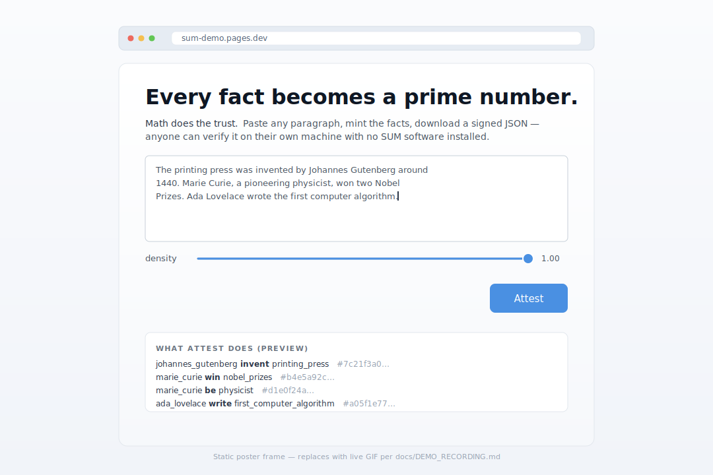

# SUM — The Semantic Understanding Machine

<p align="center">
  <a href="single_file_demo/index.html">
    
  </a>
</p>
<p align="center"><em>
  Above: the single-file demo (<code>single_file_demo/index.html</code>). A 15-second recording of the full paste→attest→verify loop is queued — see <a href="docs/DEMO_RECORDING.md">docs/DEMO_RECORDING.md</a> for the one-take runbook; the poster frame fills this slot until the GIF lands.
</em></p>

[](https://github.com/OtotaO/SUM/actions/workflows/quantum-ci.yml)

> **From Tags to Tomes and Back Again — canonical round-trip proven, full pipeline measured.**

SUM began as a humble bidirectional knowledge distillation engine: turn **structured facts** (tags) into **coherent narratives** (tomes) and vice versa, with adjustable knobs for density, length, formality, audience, and perspective. What emerged is a **semantic algebra** that represents knowledge as prime-factored integers, giving a mathematically proven round-trip on the canonical representation and an empirical faithfulness score on the full text→structure→text loop.

**The core insight remains unchanged**: knowledge should flow fluidly between structured and narrative forms. That flow is **cryptographically verified** in every signed bundle, **mathematically guaranteed** on the canonical layer (round-trip drift = 0.00 %, proven), and **continuously measured** on real prose (FActScore 0.94–0.96 on `seed_v1`, 0.762 F1 with precision 1.000 on `seed_v2`, tracked by the bench harness). Every claim in this repo is labelled with an explicit epistemic status — see [`docs/PROOF_BOUNDARY.md`](docs/PROOF_BOUNDARY.md) for the separation of proved from measured.

---

## 📊 Current Measured State

Every headline number below is reproducible via `python -m scripts.bench.run_bench` or the harnesses in `scripts/verify_*.py`. See [`docs/PROOF_BOUNDARY.md`](docs/PROOF_BOUNDARY.md) for the full truthfulness document and per-claim epistemic status.

| Axis | Value | Epistemic Status |
|---|---|---|
| Canonical round-trip drift | **0.00 %** on seed_tiny / seed_v1 / seed_v2 | **provable** (Ouroboros protocol, §1.1) |
| Extraction F1 on `seed_v1` (50 simple-SVO docs) | **1.000** | empirical-benchmark |
| Extraction F1 on `seed_v2` (20-doc difficulty corpus) | **0.762** (precision **1.000**, recall 0.615) | empirical-benchmark |
| Regeneration FActScore on `seed_v1` | **0.940–0.960** (two runs, one week apart, same pinned model) | empirical-benchmark |
| LLM narrative round-trip drift on `seed_v1` | **107.75 %** (facts preserved, keys not — see §2.5) | empirical-benchmark |
| LLM narrative exact-match recall on `seed_v1` | **0.12** (6/50 source triples surface-preserved) | empirical-benchmark |
| Sieve re-extract of canonical (known ceiling) | **54.00 %** (seed_v1) / 56.25 % (seed_v2) | empirical-benchmark |
| Merge p50 @ N=1000 primes | ~518 ms (~O(n²)) | empirical-benchmark |
| `record_provenance_batch` sustained throughput | **~22 k ops/sec** (10.2× the single-write path) | empirical-benchmark |
| Merkle-chain integrity under concurrent writers | holds (50–200-event bursts) | **provable** (post `9c4139d`) |
| Cross-runtime byte-identity fixtures | **131 / 131 passing** across Python ↔ Node.js ↔ Browser JS | empirical-benchmark |
| Test suite | **907 collected** (4 known jwt-missing collection errors) | continuous |

---

## 🌱 The Evolution: From Simple to Sublime

### Genesis: The Original Vision (2023)
```
Text → Structured Facts → Text
  ↑                        ↓
Adjustable Parameters & Style Control
```

**Problem**: How do we bidirectionally transform between:
- **Tags** (structured semantic facts: `alice||age||30`)
- **Tomes** (natural language narratives: "Alice is 30 years old...")
- With **adjustable knobs** for tone, detail, perspective, and focus

### Evolution: The Mathematical Substrate (2024-2026)
```
Perspectival Text → Prime-Encoded Facts → Verified Narratives
        ↑                    ↓                        ↓
   Multi-Viewpoint    Gödel Integer          Round-Trip Verified
    Classification   (Single Source of Truth)    Generation
```

**Breakthrough**: Every fact becomes a **unique prime number**. The entire knowledge state is a **single integer** (product of all active primes). This enables:
- **Verified Generation**: `State % Prime == 0` proves a fact is grounded
- **Zero-Cost Sync**: Send one integer, use GCD to compute exact deltas
- **Git for Truth**: Branch = copy integer; Merge = LCM operation
- **Multi-Perspectival Views**: Same facts, different narrative styles per viewpoint

### Future: The Polytaxis Integration (2026+)
```
Multi-Perspective Classification ←→ Verified Multi-Narrative Generation
            ↑                                    ↓
    Formal Ontological Bridges          Category-Theoretic Alignment
         ↑                                    ↓
Semantic Branching & Temporal Evolution ←→ Accountable Pluralism
```

**Vision**: SUM's mathematical substrate becomes the foundation for **Polytaxis** — a meta-classification system that hosts multiple perspectives simultaneously, bridges them through category theory, and generates perspective-aware narratives with formal guarantees.

---

## 🧮 Core Transformation Capabilities

### 1. **Tomes → Tags** (Semantic Extraction)
```python
# Natural language → Structured knowledge
POST /ingest
{
  "text": "Alice met Bob at Stanford in 1995. She studied AI while he focused on databases.",
  "perspective": "academic"  # Optional: academic, personal, legal, etc.
}

# Returns: Crystallized facts
{
  "delta_axioms": [
    "alice||met||bob",
    "alice||location||stanford",
    "bob||location||stanford",
    "alice||study_focus||ai",
    "bob||study_focus||databases",
    "alice||met_bob_year||1995"
  ],
  "new_global_state": "89471829047120947812904...",  # Prime-encoded
  "perspective": "academic"
}
```

### 2. **Tags → Tomes** (Generation with measured faithfulness)
```python
# Structured knowledge → Natural narrative
POST /extrapolate
{
  "target_axioms": ["alice||met||bob", "alice||study_focus||ai"]
}

# Returns: a narrative rendered by LiveLLMAdapter.generate_text
{
  "narrative": "Alice met Bob; Alice's focus is on artificial intelligence...",
  "canonical_appendix": "The alice met bob.\nThe alice study_focus ai.",
  "state_integer": "89471829047120947812904..."
}

# For independent faithfulness measurement, run the bench harness:
#   python -m scripts.bench.run_bench --corpus scripts/bench/corpora/seed_v1.json
# → FActScore per corpus, currently 0.960 on seed_v1
# Note: per-request entailment gating is a roadmap item; today the LLM
# adapter generates faithful prose most of the time but is not hallucination-
# gated at the endpoint level.
```

### 3. **Round-Trip Conservation** (The Ouroboros Protocol)
```python
# Prove semantic conservation: Text → Tags → Text → Tags
POST /ouroboros/verify
{
  "text": "Original narrative about Alice and Bob..."
}

# Returns: Mathematical proof of conservation
{
  "round_trip_verified": true,
  "original_state": "894718290471...",
  "reconstructed_state": "894718290471...",  # Must be identical
  "information_preserved": 1.0,
  "canonical_tome": "Verified canonical reconstruction..."
}
```

---

## 🔄 Sliding-Scale Rendering (currently density-actionable; others LLM-gated)

The `TomeSliders` interface parameterizes rendering across five `[0.0, 1.0]` axes:

```python
from internal.ensemble.tome_sliders import TomeSliders
from internal.ensemble.tome_generator import AutoregressiveTomeGenerator

sliders = TomeSliders(
    density=0.5,       # actioned on canonical path (deterministic axiom subsetting)
    length=0.8,        # LLM-gated (no-op without extrapolator)
    formality=0.3,     # LLM-gated
    audience=0.7,      # LLM-gated
    perspective=0.5,   # LLM-gated
)
tome = generator.generate_controlled(state, sliders)
# Output includes slider metadata in the header for reproducibility.
```

**What ships today:** the 5-axis type, validation, `requires_extrapolator()` gate, `header_line()` serialization, and the density axis actioned on the deterministic canonical path via lexicographic subsetting. 21 tests pin the contract. See `internal/ensemble/tome_sliders.py`.

**What is roadmap:** the other four axes (length, formality, audience, perspective) require an LLM extrapolator and are no-ops on the canonical path today — their values are captured in the output header as metadata so a future LLM-backed renderer can honour them. Per-perspective functorial bridges (category-theoretic mappings between perspective ontologies) are Phase 26 vision, not current capability.

---

## 🌌 Mathematical Architecture

```text
┌─────────────────────────────────────────────────────────────────────┐
│                    SUM: Semantic Understanding Machine              │
│                                                                     │
│  ┌─────────────┐  ┌─────────────┐  ┌──────────────────────────────┐ │
│  │ Perspective │  │ Transform   │  │ Verification & Sync          │ │
│  │ Management  │  │ Engine      │  │ • Round-Trip Conservation    │ │
│  │ • Viewpoints│  │ • Tags→Tomes│  │ • Mathematical Proof         │ │
│  │ • Bridges   │  │ • Tomes→Tags│  │ • Decentralized P2P          │ │
│  │ • Evolution │  │ • Style Ctrl│  │ • Temporal Branching         │ │
│  └──────┬──────┘  └──────┬──────┘  └──────────────┬───────────────┘ │
│         │                │                        │                 │
│  ┌──────┴────────────────┴────────────────────────┴──────────────┐  │
│  │                 Gödel Semantic Algebra                        │  │
│  │  • Prime Encoding: Facts → Unique Primes                      │  │
│  │  • State Integer: Global_State = ∏(all active primes)         │  │
│  │  • Verification: State % Prime == 0 (fact exists)             │  │
│  │  • Sync Protocol: GCD(State_A, State_B) = exact delta         │  │
│  │  • Branching: Branch = Integer Copy (O(1) operation)          │  │
│  │  • Merging: LCM(Branch_A, Branch_B) = unified truth           │  │
│  └────────────────────────────────────────────────────────────────┘  │
│                                                                     │
│  ┌─────────────────────────────────────────────────────────────────┐ │
│  │                    Akashic Ledger                              │ │
│  │     Event-sourced • Merkle Chain • Time Travel • Git-like      │ │
│  └─────────────────────────────────────────────────────────────────┘ │
└─────────────────────────────────────────────────────────────────────┘
```

---

## 🎯 Concrete Use Cases: From Personal to Planetary

| Transformation Pattern | Input | Output | Why SUM |
|----------------------|--------|---------|---------|
| **Personal Knowledge Assistant** | "I learned about quantum computing today..." | Structured facts + retrievable Q&A | **Verified answers** - no hallucination, mathematical proof of groundedness |
| **Multi-Perspective Research** | Academic papers on climate change | Structured facts per perspective (scientific, economic, political) | **Accountable pluralism** - same facts, different valid interpretations |
| **Collaborative Documentation** | Team meeting notes | Canonical knowledge base + personalized summaries | **Conflict resolution** - contradictions detected and mediated mathematically |
| **Cross-Cultural Knowledge** | Same events described by different cultures | Multiple valid narrative representations | **Perspective bridges** - formal mappings between worldviews |
| **Temporal Knowledge Evolution** | Historical document corpus | Time-indexed knowledge with evolution tracking | **Git for truth** - branch, merge, and time-travel through knowledge states |
| **Decentralized Truth Networks** | Global news and research papers | Synchronized planetary knowledge graph | **Zero-JSON sync** - one integer communicates exact knowledge delta |

---

## 🚀 Quick Start: From Zero to Semantic Algebra

### 1. Boot the Transformation Engine
```bash
git clone https://github.com/OtotaO/SUM.git
cd SUM
pip install -r requirements-prod.txt

# Verify mathematical correctness
python -m pytest Tests/ -v
python scripts/verify_fortress.py --json

# Launch with LLM integration
export OPENAI_API_KEY="sk-..."
uvicorn quantum_main:app --reload --port 8000
```

### 2. Try Basic Transformations
```bash
# Text → Facts
curl -X POST http://localhost:8000/api/v1/quantum/ingest \
  -H "Content-Type: application/json" \
  -d '{"text": "Alice is 30 years old and works at Stanford."}'

# Facts → Text
curl -X POST http://localhost:8000/api/v1/quantum/extrapolate \
  -H "Content-Type: application/json" \
  -d '{"target_axioms": ["alice||age||30", "alice||works_at||stanford"]}'

# Round-trip verification
curl -X POST http://localhost:8000/api/v1/quantum/ouroboros/verify \
  -H "Content-Type: application/json" \
  -d '{"text": "Alice is 30 years old and works at Stanford."}'
```

### 3. Explore the Live Interface
Open `http://localhost:8000` to access:
- **Knowledge Graph Visualization** - See facts crystallize in real-time
- **Ask Bar** - Natural language queries with verified answers
- **Perspective Switcher** - Generate different narratives from same facts
- **Live Telemetry** - Watch the semantic algebra work
- **WASM Offline Mode** - Local knowledge processing without servers

---

## 📡 API Reference: The Transformation Endpoints

### Core Transformations
| Method | Endpoint | Transform | Description |
|--------|----------|-----------|-------------|
| `POST` | `/ingest` | Tomes → Tags | Extract structured facts from natural language |
| `POST` | `/ingest/math` | Direct → Tags | Insert structured triplets directly (zero LLM cost) |
| `POST` | `/extrapolate` | Tags → Tomes | Generate verified narratives from facts |
| `POST` | `/rehydrate` | State → Tome | Convert entire knowledge state to readable form |
| `POST` | `/ask` | Query → Verified Answer | Natural language Q&A with proof |

### Verification & Integrity
| Method | Endpoint | Purpose |
|--------|----------|---------|
| `POST` | `/ouroboros/verify` | Prove round-trip conservation |
| `POST` | `/zk/prove` | Generate zero-knowledge semantic proofs |
| `GET` | `/provenance/{axiom}` | Full provenance chain for any fact |

### Perspective & Collaboration
| Method | Endpoint | Purpose |
|--------|----------|---------|
| `POST` | `/branch` | Create new perspective (fork knowledge) |
| `POST` | `/merge` | Combine perspectives (LCM operation) |
| `POST` | `/time-travel` | Rebuild knowledge at historical point |
| `POST` | `/sync/state` | Decentralized knowledge synchronization |

---

## 🌅 Future Horizons (honestly-scoped roadmap)

These are **roadmap items**, not current capabilities. Each is a concrete piece of work with a defined entry in `docs/PROOF_BOUNDARY.md` §3. They are listed in approximate order of prerequisite dependence.

### Shipped since the last README pass
- ✅ **Per-doc logging in the regeneration runner** (commit `02b4413`) — `RegenerationMetrics.per_doc` names the specific (s, p, o) triples that failed entailment so the aggregate FActScore gap is debuggable at the generator-prompt layer.
- ✅ **LLM narrative full round-trip runner** (commit `9fd232d`, first measurement `2c252f0`) — composes `LiveLLMAdapter.extract_triplets → generate_text → extract_triplets`, reports per-doc drift. Measured on `seed_v1`: 107.75 % drift / 0.12 exact-match recall. See PROOF_BOUNDARY §2.5.
- ✅ **W3C Verifiable Credentials 2.0 emission + verification** (commit `e007f94`) — pure-Python `eddsa-jcs-2022` Data Integrity path at `internal/infrastructure/verifiable_credential.py` + RFC 8785 JCS at `internal/infrastructure/jcs.py`. 58 tests. Bundles consumable by any VC-compliant ecosystem.
- ✅ **Passive-voice truth fix** (commit `b751222`) — sieve now swaps `agent → pobj` into the subject slot and suppresses agentless passives; seed_v2 F1 rose 0.634 → 0.762, precision to 1.000, zero false positives on the difficulty corpus.
- ✅ **`record_provenance_batch`** (commit `9ed49bf`) — single-transaction batched ingest; 10.2× throughput (2 k → 22 k ops/sec), within 30 % of the crypto ceiling.
- ✅ **Merkle-chain concurrency fix** (commit `9c4139d`) — `BEGIN IMMEDIATE` serialises writers at the SQLite boundary; tamper-detection invariant now holds under concurrent writers (previously silently broke at two-plus parallel appends).
- ✅ **Cross-runtime byte-identity substrate** — shared `standalone_verifier/math.js` consumed by both `verify.js` and `single_file_demo/godel.js` (commit `7ca3e56`); 131 fixtures assert Python ↔ Node ↔ Browser agreement across JCS canonicalisation, prov_id computation, prime derivation, and state-integer encoding.
- ✅ **Single-file browser demo** (`single_file_demo/index.html`) — paste any paragraph, press Attest, download a CanonicalBundle JSON; hand it to anyone with Node + `verify.js` for independent verification. Upgrades automatically to LLM-grade extraction when pasted into a Claude artifact conversation via `window.claude.complete` (commit `e5e57b6`).

### Near-term (next 1–2 milestones)
- **LLM wiring for the 4 remaining sliders** — length / formality / audience / perspective. Interface is already shipped in `internal/ensemble/tome_sliders.py`; what's missing is the prompt-conditioning layer that honours each axis.
- **Calibration fixture authoring for Venn-Abers** — turns zero-width confidence intervals into meaningful bounds. Needs a labelled `(score, was_correct)` set.
- **Remaining sieve recall work** — seed_v2 precision is 1.000, recall 0.615; closing the recall gap means apposition / relative-clause / compound-conjunct extraction. All are RECALL misses now, not truth inversions.

### Medium-term (remaining Polytaxis Bucket A items)
- **SHACL structural validation** via pySHACL — W3C-standard replacement for the hand-rolled `ExtractionValidator`.
- **RFC 3161 timestamping anchor** — external witness on the Merkle chain.
- **RFC 9162 CT v2 inclusion proofs** — third-party verifiability of the audit log.
- **Full polyglot emission** — Turtle and RDF/XML beyond the JSON-LD already shipped for PROV-O and VC 2.0.

### Long-term (aspirational, requires user-pull to prioritise)
- **Category-theoretic perspective bridges** — functorial mappings between classification perspectives (Polytaxis §1). Currently no crisp use case in SUM; surface it when multi-perspective users ask.
- **Lean 4 meta-theorems** — machine-checked proofs of algebra invariants. Currently unit-tested; Lean would upgrade to `certified` epistemic status.
- **Property-graph primary store** (TerminusDB or Oxigraph) with Gödel integer demoted to attestation witness. Justified by measured merge perf (~O(n²) confirmed) above ~10k axioms.
- **Phase 19B adversarial corpus integration** into the bench harness (currently Phase 19B is separately maintained).

Items *not* on this roadmap that earlier drafts suggested: perspective-as-functor as a core mechanic (it's a classification abstraction, wrong category for the distillation product); zero-knowledge entailment proofs via Halo2/Plonky2 (too early; added only when a specific user needs it); multi-formal-method specification stack (Alloy + TLA+ + Lean 4 — three formalisms is more than a small team can maintain).

---

## 🌐 Single-File Deployment — Cloudflare Pages

SUM's user-facing demo is one self-contained HTML file: [`single_file_demo/index.html`](single_file_demo/index.html). No build step, no framework, no server. It runs in any modern browser and in the Claude artifact runtime without modification.

### What the demo does

1. User pastes any paragraph into a textarea.
2. A density slider (0.1 → 1.0) subsets the extracted triples lexicographically — same deterministic rule as Python's `tome_sliders.apply_density`.
3. "Attest" mints a prime per triple via `sha256_64_v1` in-browser (BigInt + WebCrypto), LCMs them into a Gödel state integer, and emits a `CanonicalBundle` JSON with the canonical tome, axiom count, state integer (decimal + hex), timestamp, and version headers.
4. "Download" hands the user the `.json` file. "Verify" recomputes the state integer from the canonical tome in-page and confirms the match.
5. The same `.json` file validates under `node standalone_verifier/verify.js bundle.json` for anyone who prefers an independent runtime — ✅ WITNESS VERIFICATION PASSED is the expected output.

### Deployment recipe

Cloudflare Pages is the chosen host — recommended after comparing Vercel, Netlify, GitHub Pages, and an R2 bucket for this specific (static, zero-backend, optionally-LLM) shape:

- **Why Pages over Vercel:** free-tier bandwidth is unmetered (Vercel's hobby tier soft-caps at 100 GB/month with overage risk). ~330 edge PoPs vs Vercel's narrower free-tier anycast. Framework preset "None" means we ship `single_file_demo/` as-is with no Next.js mirror — the file is already a complete product.
- **Why Pages over GitHub Pages:** Pages Functions gives the v1 upgrade path (a `functions/api/complete.ts` drops in alongside the static assets as a colocated Worker isolate; same deploy, same domain, same dashboard) without migrating platforms when the Claude-proxy endpoint is added for users outside the Claude artifact runtime.

Minimum setup:

```bash
# One-time: link the repo on dash.cloudflare.com → Pages → "Connect to Git"
#   Framework preset:    None
#   Build command:       (leave empty)
#   Build output:        single_file_demo

# Every push to main auto-deploys. Or CLI:
npx wrangler pages deploy single_file_demo --project-name sum-demo
```

No environment variables required. No KV / R2 / D1 attached. The demo is 100 % client-side.

### v1 upgrade path (Claude proxy for non-artifact users)

The current file upgrades extraction to LLM-grade *automatically* when pasted into a Claude artifact (commit `e5e57b6` — `window.claude.complete` is detected at runtime). For users on the plain Cloudflare Pages URL without a Claude account, extraction falls back to a naive tokeniser and a "paste into a Claude artifact for LLM-grade recall" hint is shown.

When demand justifies it, a colocated Pages Function at `functions/api/complete.ts` proxies Claude or OpenAI calls using the user's own API key (stored in the browser, never on the server). Same deploy, no platform migration.

### Roadmap — hybrid edge architecture (not shipped today)

- **WASM module** from the `core-zig/` tree — browser-side LCM/GCD for BigInt arithmetic. Infrastructure exists (the Zig core has WASM exports); the Python fallback path is what runs in production today.
- **Cloudflare KV** — cross-device state sync for an optional "my attested knowledge graph" layer.
- **Cloudflare Durable Objects** — real-time multiplayer merges of attested bundles across peers.

These are vision items; the shipped today is the static artifact above.

---

## 🛡️ Verification: 907-Test Suite + 131 Cross-Runtime Fixtures

The test suite covers both proven invariants and empirically-measured properties; each assertion is scoped to the epistemic status of the thing it tests. 907 tests collected; 4 known collection errors are the jwt-module-missing issue in the quantum-router test stack, tracked as an ops item, not a regression.

```text
Provable (deterministic code + tests that enforce the proof):
  ✓ Canonical Round-Trip Conservation — 0.00 % drift on seed_tiny / seed_v1
    / seed_v2 (Ouroboros §1.1)
  ✓ Algebra Invariants — LCM commutativity / associativity, merge idempotency,
    entailment correctness, delta correctness, deletion correctness
  ✓ Akashic Ledger Durability — event-sourced replay, branch isolation
  ✓ Merkle Hash-Chain Integrity — SHA-256 chain (Phase 19C) — now holds
    under concurrent writers (commit 9c4139d, BEGIN IMMEDIATE discipline
    centralised in AkashicLedger._write_txn)
  ✓ Cross-Runtime State Equivalence — THREE runtimes agree byte-for-byte:
    Python (sympy) ↔ Node.js (BigInt Miller-Rabin via math.js) ↔ in-browser
    JavaScript (single_file_demo/index.html). 131 fixtures across:
      – 26 JCS byte-identity (scripts/verify_jcs_byte_identity.py)
      –  7 prov_id byte-identity (scripts/verify_prov_id_cross_runtime.py)
      – 18 prime-derivation + state-encoding (scripts/verify_godel_cross_runtime.py)
      –  2 CanonicalBundle K-tests (scripts/verify_cross_runtime.py)
      – 30 JS-local JCS tests + 20 JS-local provenance tests
      – 10 verify.js self-test + 18 v2-parity tests

Empirically measured (reported by the bench harness):
  ✓ Extraction F1 on seed_v1 — 1.000 on 50 simple-SVO docs
  ✓ Extraction F1 on seed_v2 — 0.762 with precision 1.000 on the 20-doc
    difficulty corpus (apposition, passive, relative-clause, conjunction,
    negation, hedging, complex-PP). Every failure is a recall miss, never
    a truth inversion.
  ✓ Regeneration FActScore — 0.940 / 0.960 (LLM narrative + entailment
    checker, two runs one week apart at the same pinned model; see
    PROOF_BOUNDARY §2.4)
  ✓ LLM narrative full round-trip drift — 107.75 % / 0.12 exact-match
    recall on seed_v1 (see §2.5). Facts preserved, keys not.
  ✓ Operation performance — p50 / p99 at N ∈ {100, 500, 1000, 5000}
    including the provenance path: 22 k ops/sec batched ingest, within
    30 % of the 28 k/sec crypto ceiling.
  ✓ Sieve re-extract of canonical — 54.00 % (seed_v1) / 56.25 % (seed_v2)
    drift

Cryptographic integrity:
  ✓ HMAC-SHA256 signatures + Ed25519 key rotation
  ✓ Bundle tamper detection (CanonicalBundle + VC 2.0)
  ✓ Adversarial bundle handling
  ✓ W3C Verifiable Credentials 2.0 — eddsa-jcs-2022 Data Integrity suite,
    pure-Python RFC 8785 JCS, 58 tests covering sign/verify round-trip,
    tamper detection, JSON-on-disk persistence, multibase base58btc
    round-trip, key-reordering resilience

Ledger concurrency:
  ✓ 6 stress tests under 50-200 parallel append_event calls — Merkle chain
    stays verifiable; INSERT-OR-IGNORE dedup collapses concurrent
    identical writes; 1000 distinct concurrent writes land exactly
    1000 rows (no drops)

Interop (Polytaxis Bucket A absorption):
  ✓ Epistemic Status Taxonomy — {provable, certified, empirical-benchmark,
    expert-opinion} on every metric
  ✓ Venn-Abers Conformal Intervals — distribution-free confidence bounds
  ✓ PROV-O JSON-LD Emission — Akashic Ledger events → W3C PROV-O graph
  ✓ TomeSliders — 5-axis slider interface (density actioned on canonical
    path; four LLM-gated axes captured as metadata in the output header)
```

**Every claim carries an explicit epistemic status.** The canonical round-trip is mathematically proven; the broader text→structure→text pipeline is empirically measured and reported honestly. See [`docs/PROOF_BOUNDARY.md`](docs/PROOF_BOUNDARY.md) for the separation of proved from measured and the list of what's still aspirational.

---

## 🎨 Interface Vision: Beyond CRUD to Semantic Flow

### The Transformation-Centric UI
```
┌─────────────────────────────────────────────────────┐
│  ┌─────────────┐    Transform    ┌─────────────────┐ │
│  │    TOMES    │ ← ← ← ← ← ← ← ← │      TAGS       │ │
│  │  Narrative  │                 │   Structured    │ │
│  │   Content   │ → → → → → → → → │     Facts       │ │
│  │             │                 │                 │ │
│  │ • Stories   │     Verified    │ • Triplets      │ │
│  │ • Reports   │   Bidirectional │ • Relations     │ │
│  │ • Essays    │  Transformation │ • Properties    │ │
│  │ • Docs      │                 │ • Assertions    │ │
│  └─────────────┘                 └─────────────────┘ │
│                                                      │
│  ┌─────────────────────────────────────────────────┐ │
│  │            PERSPECTIVE SELECTOR                 │ │
│  │  [Academic] [Personal] [Legal] [Cultural]       │ │
│  │  [Scientific] [Historical] [+Custom]            │ │
│  └─────────────────────────────────────────────────┘ │
│                                                      │
│  ┌─────────────────────────────────────────────────┐ │
│  │              STYLE CONTROLS                     │ │
│  │  Detail: [●────────] Granularity               │ │
│  │  Tone:   [Formal] [Casual] [Technical]         │ │
│  │  Focus:  [Overview] [Deep Dive] [Summary]      │ │
│  └─────────────────────────────────────────────────┘ │
└─────────────────────────────────────────────────────┘
```

### Key Interface Innovations
1. **Bi-directional transformation as primary interaction**
2. **Live perspective switching** - same content, different viewpoints
3. **Mathematical verification indicators** - visual proof of groundedness
4. **Collaborative conflict resolution** - merge perspectives gracefully
5. **Temporal sliders** - explore knowledge evolution over time

---

## 🤝 Contributing to the Semantic Revolution

1. **Fork & Branch** - Create your perspective branch
2. **Test Mathematically** - `python -m pytest Tests/ -v`
3. **Verify Fortress** - `python scripts/verify_fortress.py --json`
4. **Transform & Submit** - Your PR becomes part of the verified knowledge base

**Join us in building the first mathematically rigorous knowledge transformation engine.**

---

## 📜 License & Philosophy

Apache 2.0 — **Built for the future of human knowledge.**

*"The best way to predict the future is to invent it. The best way to preserve knowledge is to make it mathematically eternal."*

---

<p align="center">
<strong>SUM — From Tags to Tomes and Back Again.</strong><br>
<em>Canonical round-trip mathematically proven. Full pipeline continuously measured. Every claim labelled.</em>
</p>